# Banking-Microservices

The "banking-microservices" app is a modern banking application built using microservices architecture, Spring Boot, and various other technologies for a solution addressed in the banking domain.

This banking management system uses microservices architecture, allowing for scalability, maintainability, and flexibility. It consists of multiple microservices, each responsible for a specific aspect of banking functionality.

## Spring Eureka Instances

Eureka facilitates service registration and discovery within the microservices architecture.

<div>
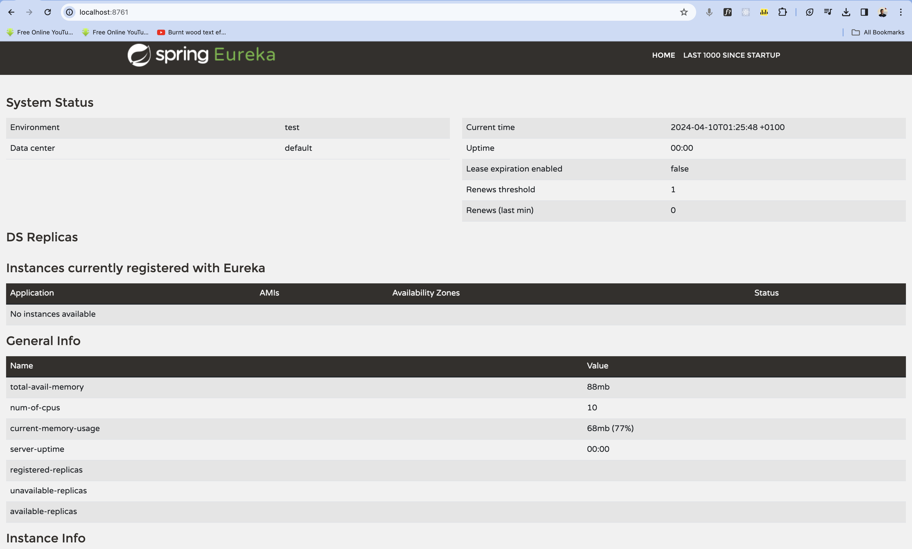
</div>
The image below shows the Spring Eureka dashboard with instances currently registered.

<div>
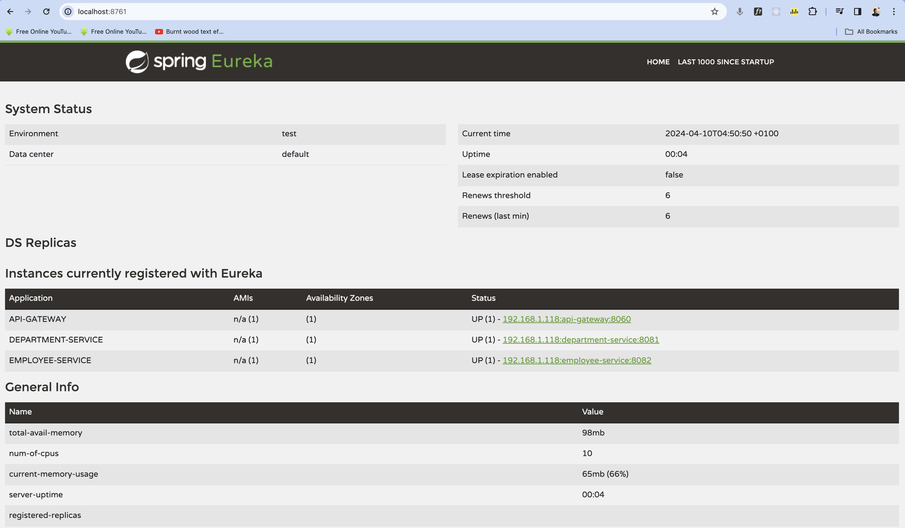
</div>

## Features

- **Microservice Architecture:** Utilizes a distributed architecture to enable independent deployment and scaling of different components.
- **Spring Boot:** Built using Spring Boot framework for rapid development and ease of configuration.
- **RESTful APIs:** Implements RESTful APIs for communication between microservices, enabling seamless integration and interoperability.
- **Service Registry:** Utilizes a service registry for service discovery and registration, facilitating dynamic routing and load balancing.
- **Config Server:** Implements a centralized configuration server to manage application properties across microservices.
- **Distributed Tracing:** Incorporates distributed tracing for monitoring and debugging microservices interactions.
- **API Gateway:** Implements an API gateway to handle routing, security, and cross-cutting concerns, providing a unified entry point for clients.

### Docker Instance

The image above displays a Docker instance running the Zipkin container image in isolated environments. I started the Zipkin via docker command of,

```
docker run -d -p 9411:9411 openzipkin/zipkin
```

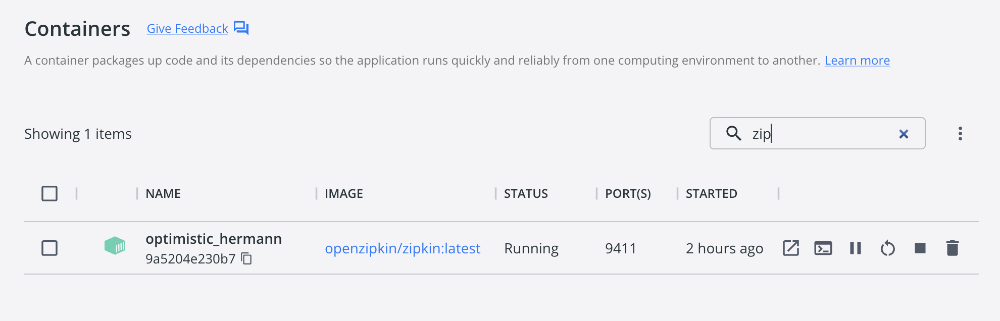

### Zipkin Tracing

The screenshots depict Zipkin, a distributed tracing system, in two states: without the API gateway configured and with the API gateway configured. It helps monitor microservices interactions and trace requests across the system.

#### Initial State:

<div style="display: flex; gap: 20px">
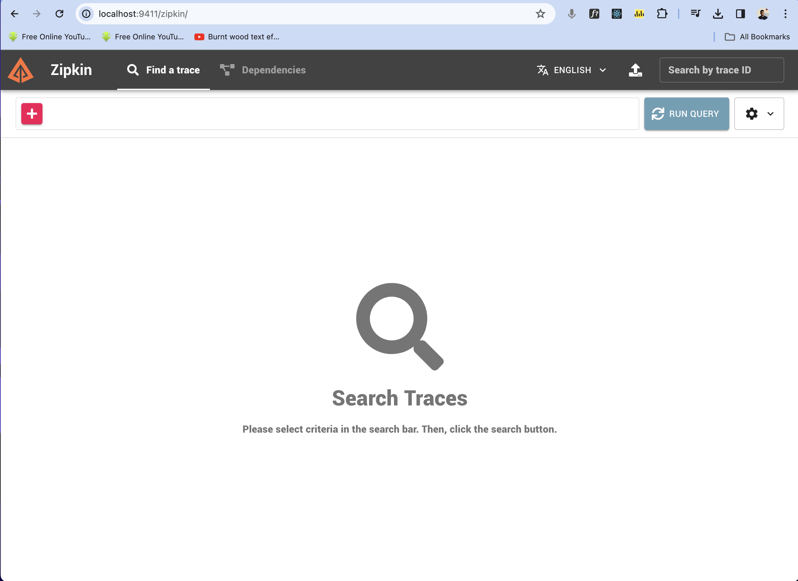
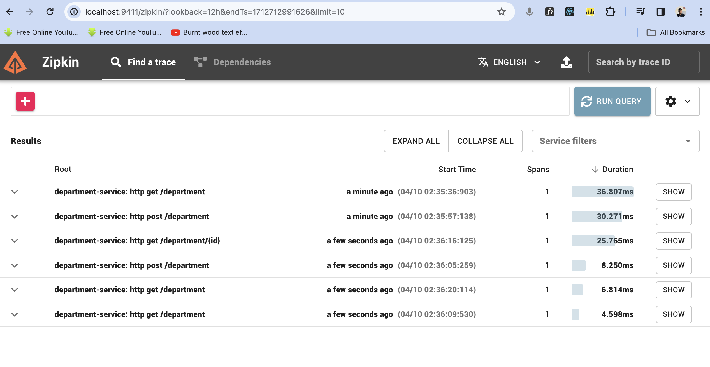
</div>

#### Without API Gateway:

<div style="display: flex; gap: 20px">
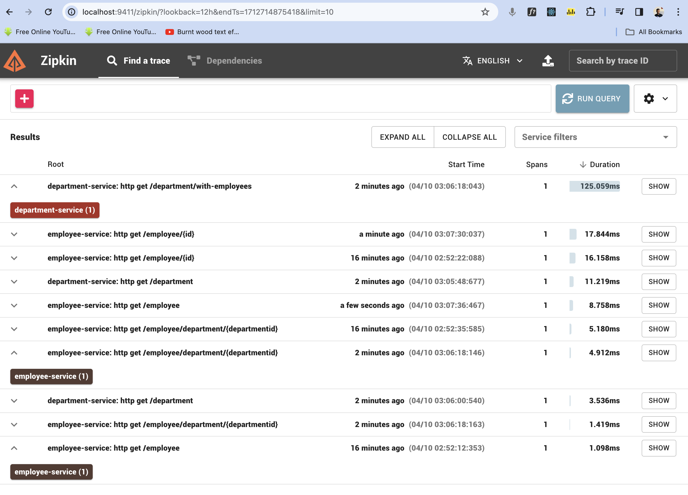
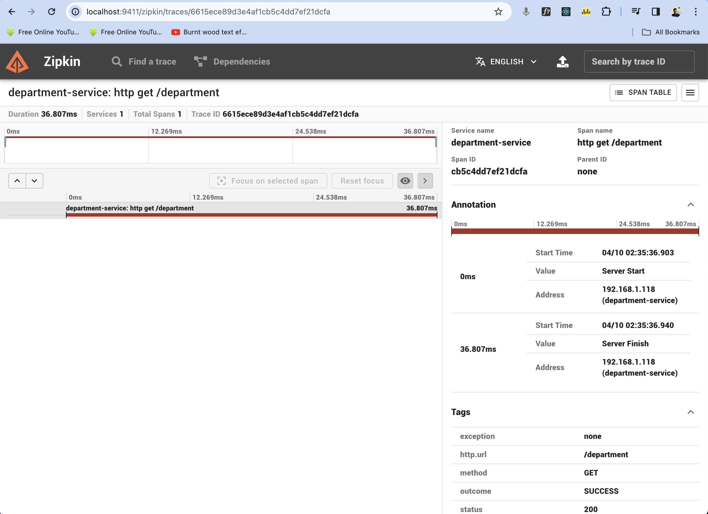
</div>

#### With API Gateway:

<div style="display: flex; gap: 20px">
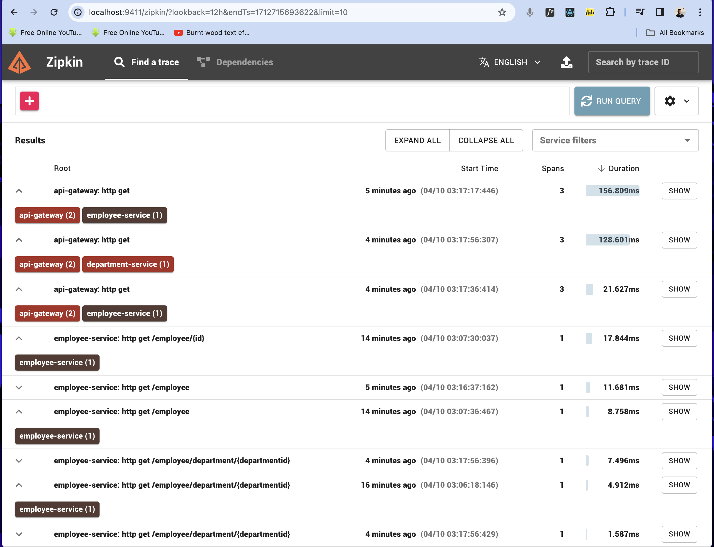
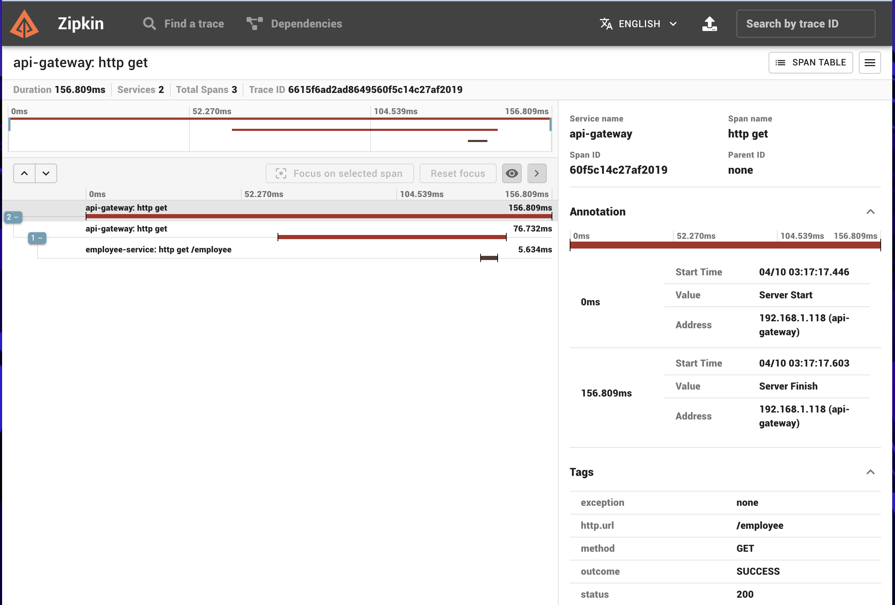
</div>

### 3. Postman API Calls

The screenshots showcase Postman making API calls to individual services. Initially, services are accessed directly, but with the API gateway configured, requests are routed through it.

#### Without API Gateway:

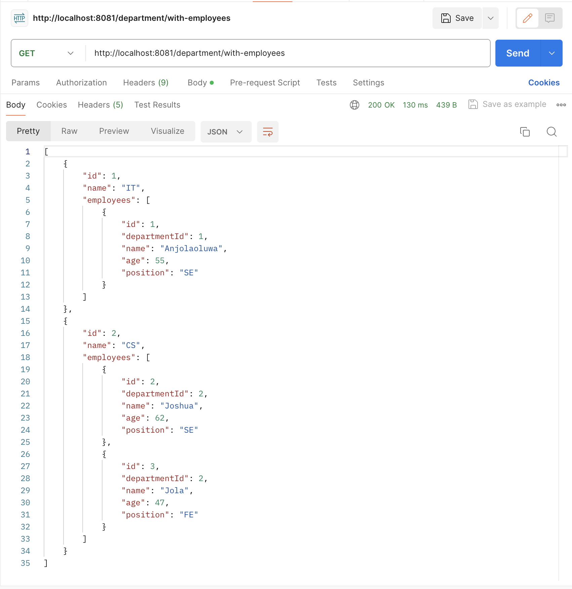

<div style="display: flex; gap: 20px">
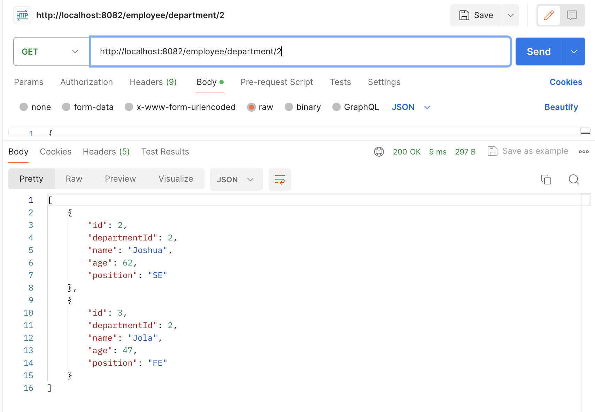
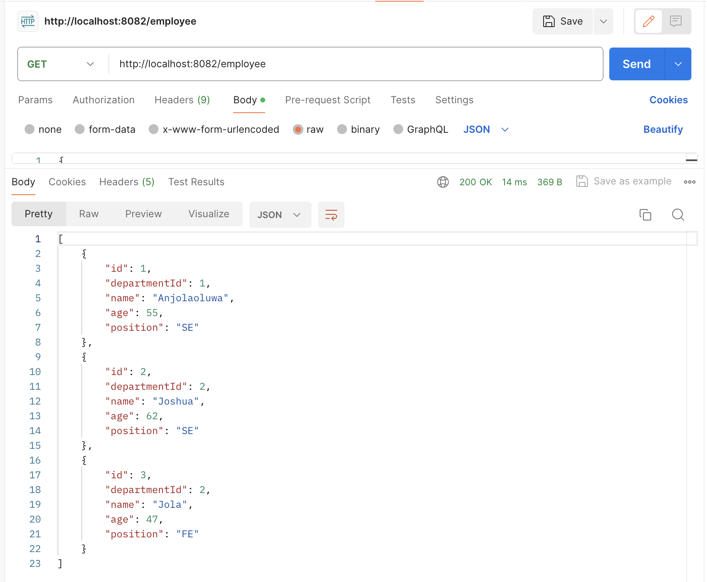
</div

#### With API Gateway:

<div style="display: flex; gap: 20px">
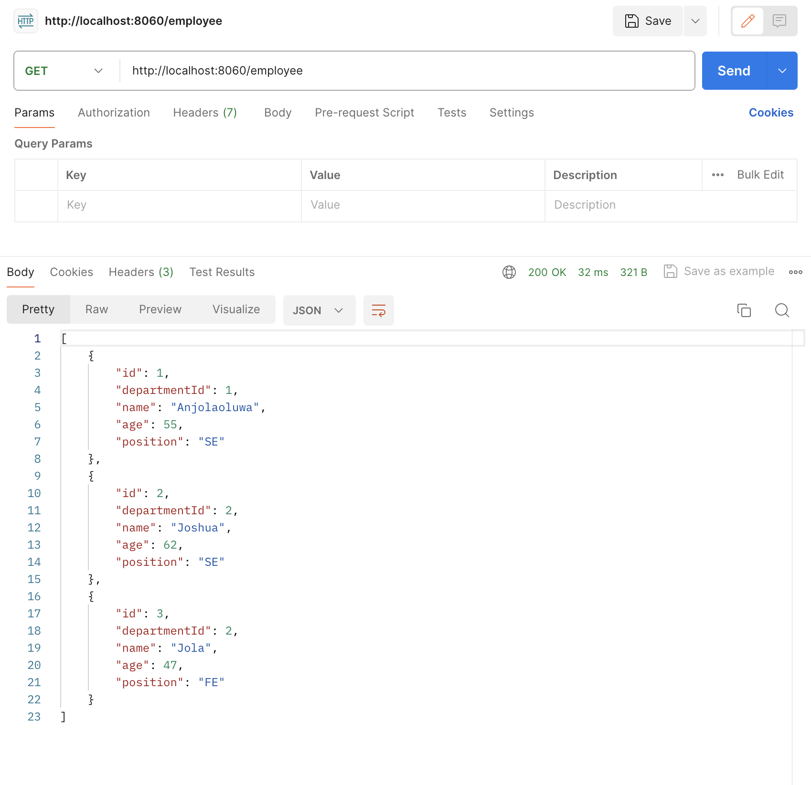

</div

## Technologies Used

- Spring Boot
- Spring Cloud
- RESTful APIs
- Docker
- Kubernetes
- Netflix Eureka (Service Registry)
- Spring Cloud Config Server
- Zipkin (Distributed Tracing)
- Zuul API Gateway
